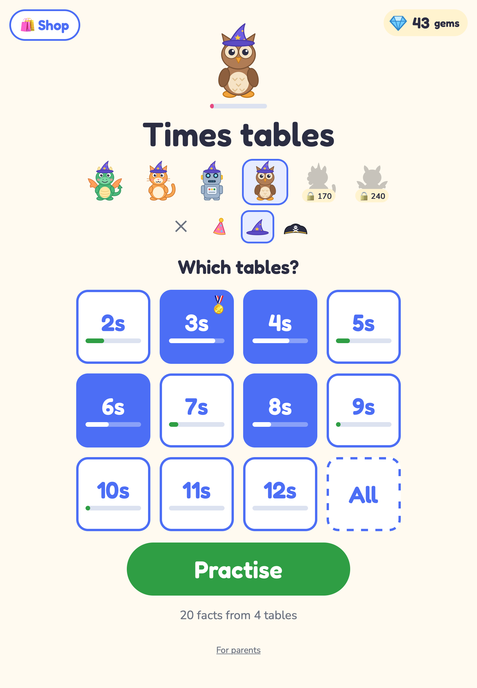
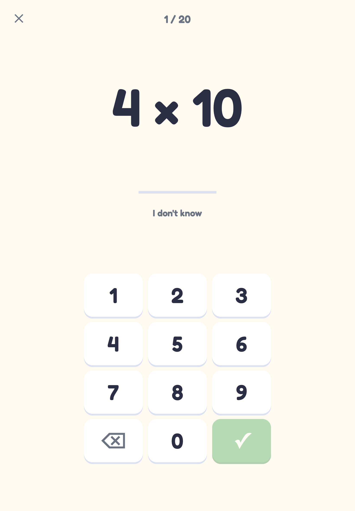
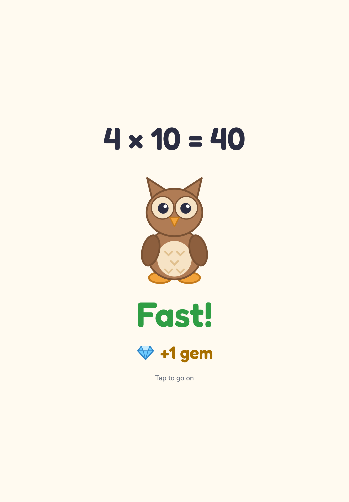
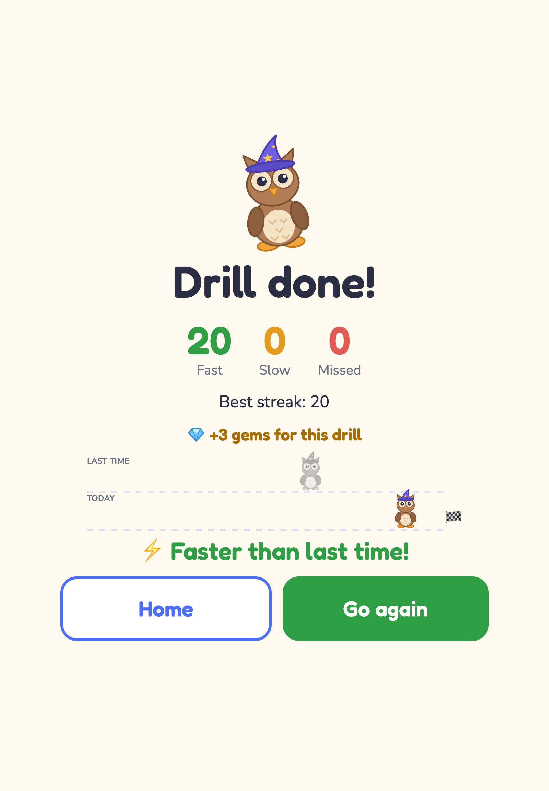
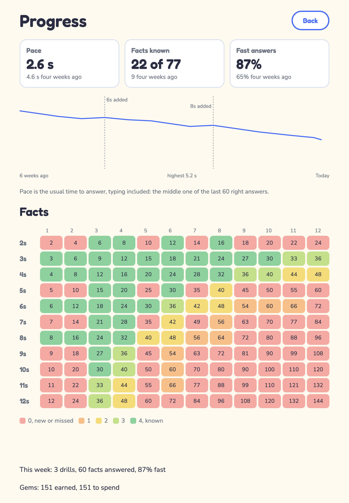
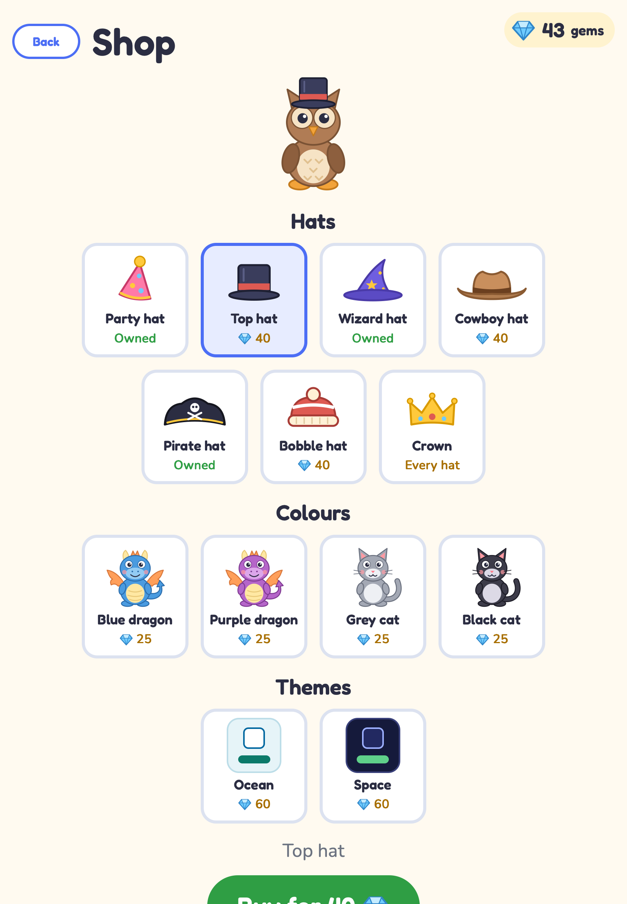

# times-tables

Times tables practice for an iPad, from the 2s to the 12s.

 · [Open the app](https://tanem.github.io/times-tables/)

## What it does

- Drills the tables from the 2s to the 12s, any mix of them, 20 questions at a sitting.
- The learner types each answer on an on-screen keypad.
- Each answer is judged against the learner's own pace, not a fixed time limit.
- Each fact has a level, and facts at a low level come round more often.
- Gems reward progress, unlock characters that react to each answer, and buy hats in the Shop.
- Works offline on an iPad once installed, with no accounts and no server.

Built for a child learning the tables at home.

## Install on an iPad

Open https://tanem.github.io/times-tables/ in Safari, tap the Share button, choose Add to Home Screen, and tap Add. Safari is the only browser that can do this; another browser on iOS cannot install the app.

Open the app once from its icon while the iPad is online. The installed app has its own storage, separate from the Safari tab it was added from, so its first launch needs a network to save itself. After that it works with no network at all.

Updates arrive on their own: when the app is opened with a network it fetches the new version in the background and applies it on the Start screen, never in the middle of a drill. The version and build a launch is running are shown at the bottom of the Parent view, reached from "For parents" on the Start screen, which is the way to tell an update has landed.

The progress lives only inside the installed app on that iPad. Deleting the icon erases it, moving to a new iPad does not carry it over, and there is no export.

## How it judges an answer

A right answer is fast or slow depending on how long it took against the learner's pace: the usual time this learner takes over a right answer, typing included. Pace is worked out from the learner's own recent right answers, so it moves as they improve, and a new learner has no pace until they have answered enough. A wrong answer, or tapping "I don't know", is missed, with no second try.

Each fact has a level. A fast answer moves it up, a slow one moves it down, and a missed one takes it back to the start. The next fact is chosen so that facts at a low level come round more often, and no fact is ever retired.

A fact pays a gem the first time it reaches each level. A finished drill pays 3 gems when most of its answers were fast and 1 when a fair share were, and a drill that was faster than the last one on the same tables pays a small bonus. A table earns a badge once every one of its facts has reached level 4, and the answer that earns it pays 10 gems; the badge stays even if a fact slips later. Gems are spent in the Shop, where six hats cost 40 gems each and owning all six earns a crown; any character can wear any owned hat, chosen under the row of characters on the Start screen. Characters unlock by the gems earned, not the gems left, so spending never locks one again: the cat unlocks at 25 gems earned, the robot at 60, the owl at 110, the unicorn at 170 and the monster at 240, and the dragon is there from the start. Each character also keeps a bond, the count of finished drills done with it: at 10, 25 and 50 it gains a new pose on the Start screen, and a meter under it shows how close the next one is. A quit drill does not count.

The terms are defined in [CONTEXT.md](CONTEXT.md), the pace rule in [ADR 0002](docs/adr/0002-pace-rule.md), the gem rule in [ADR 0004](docs/adr/0004-gem-rule.md) and the rule for spending gems in [ADR 0005](docs/adr/0005-spending-gems.md).

## Screens

The layout turns with the iPad; these are portrait.

|                                                                                                                    |                                                                                                                      |
| ------------------------------------------------------------------------------------------------------------------ | -------------------------------------------------------------------------------------------------------------------- |
|                                           |  |
|              |          |
|  |                                                                                                                      |

## For parents

"For parents" at the bottom of the Start screen opens the Parent view. It shows the learner's pace, facts known and share of fast answers against four weeks ago, a chart of pace drill by drill, a grid of every fact coloured by its level, the gems earned and left to spend, and the recent drills. Tap a fact in the grid for its counts.

The Parent view is also where progress is erased. Erasing clears everything: every level, the gems earned and the balance, the badges, the items owned, the bond with each character, the characters unlocked and the drill records. There is no undo.

## Development

Node 24, `npm ci`, then `npm run check` runs every check. See [docs/development.md](docs/development.md) for the scripts, the deploy, the dependency updates and the screenshots.

## License

[MIT](LICENSE).
